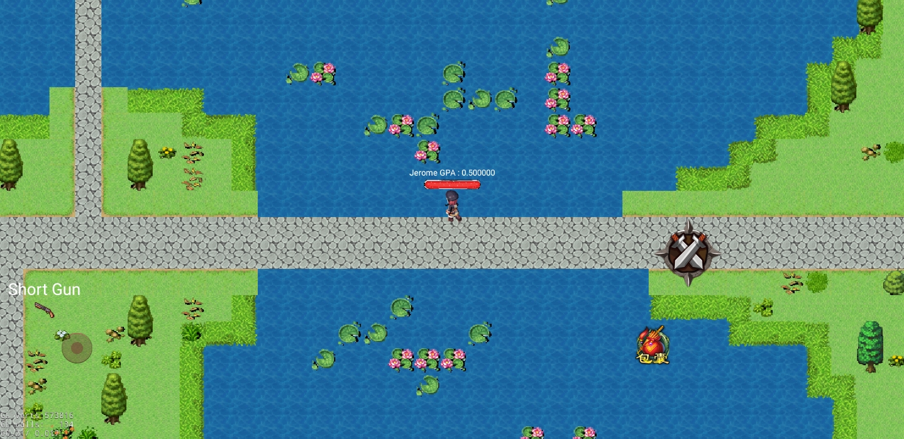
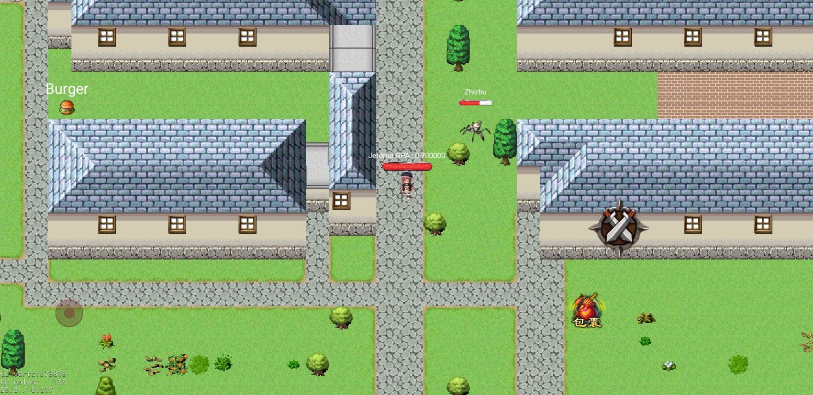
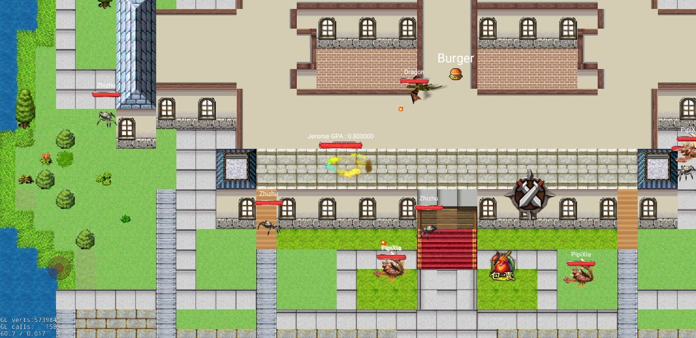

# 《决战紫禁之巅》简略介绍

## 关于

本游戏基于cocos2dx与boost，所有基本素材均来自互联网(可参见游戏开始界面的免责声明)

本游戏是SEU软件学院大一暑期实训作品，地图采自SEU九龙湖校区地图。

如果我们的程序方便了您的学习，您不妨赏我们一个Star 😀o(*￣▽￣*)ブ

也请多多支持我们的组员的项目：

Hanyuu  机器学习方向 : https://github.com/Hanyuu-Furude

qe 网络方向 : https://github.com/excitedspider

## 玩法介绍

摇杆移动，攻击键攻击，背包键使用物品、更换装备。

当地图中有一方绩点到达4.8，则游戏结束，该玩家胜利。

包含物品、等级、特效、攻击、聊天等系统

## 下载地址

https://github.com/zjdx1998/18-19-1-Game

## 游戏截图

## 游戏视频

b站链接：

## 开发文档

环境搭建请参考documents/environment.md

