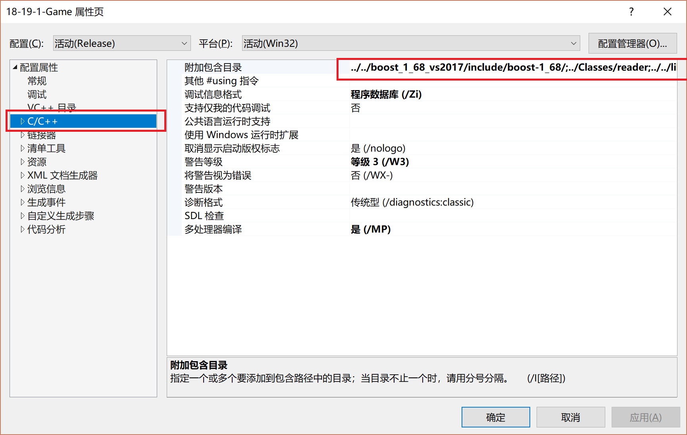
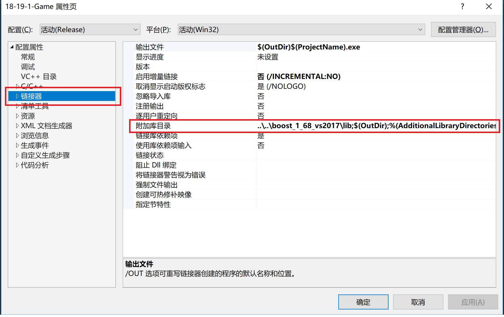
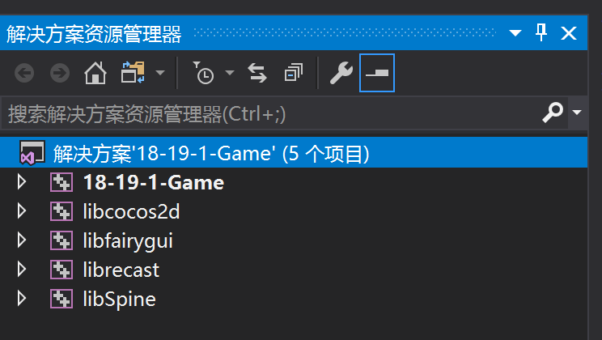
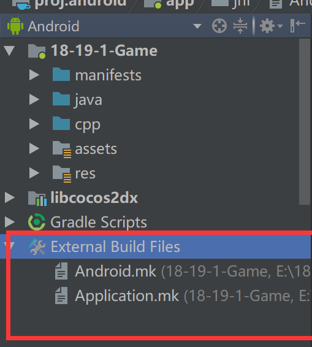

#  <center>《决战李文正之巅》环境搭建</center>

## 操作系统配置

Windows 10 64位

## 游戏引擎相关环境

1. 内核采用`cocos2dx 3.17`，下载地址:http://www.cocos.com/download

2. 辅助工具

   > 1. `Cocos Creator V2.0` ，用于部分界面设计，下载地址同上
   > 2. `FairyGUI` ，游戏主场景UI设计，下载地址：http://www.fairygui.com/
   > 3. `TileMap Editor`（地图编辑器）: https://www.mapeditor.org/ 

## 网络环境搭建

`boost v1.68`

## 开发环境

1. 对于win版 ，`Visual Studio 2017 15.8.3` 
2. 对于Android, `Android Studio 3.1.4`

## 环境搭建步骤

### Windows版

1. 从官网下载并正确安装`cocos2dx v3.17`

2. 在您的工作目录处打开命令行输入 `cocos new HereInputYourWorkSpaceName -p com.seu.newbee -l cpp`

3. 将我们的`Classes`与`Resources`文件夹覆盖至上述创建的文件夹下

4. 打开`proj.win32`w文件夹下的`sln`文件

   1. 将`Classes`中的**_reader_**添加至`VS`工作目录,并在如下图处添加`C++`包含目录

   

   2. 将编译好的`boost_1_68_vs2017`移动至与`Classes`父目录平行的位置，并在上图附加包含目录处添加
   3. 在链接器-`C/C++`-附加库目录处添加`boost_1_68_vs2017\lib`

   

   4. 将`fairyGUI`库移动至与`boost_1_68_vs2017`平行的位置，再在`VS`中添加该项目，最终结果如下：

5. 至此，您已可以运行我们的游戏。

### Android版本

1. 在保证`Windows`版本运行正常的情况下,打开`Android Studio`,并将`proj.android`添加至工作目录
2. 在下图位置处打开`Android.mk`与`Application.mk`，并添加以下内容



<center>Android.mk</center>

​	

```makefile
LOCAL_PATH := $(call my-dir)

include $(CLEAR_VARS)

$(call import-add-path,$(LOCAL_PATH)/../../../cocos2d)
$(call import-add-path,$(LOCAL_PATH)/../../../cocos2d/external)
$(call import-add-path,$(LOCAL_PATH)/../../../cocos2d/cocos)
$(call import-add-path,$(LOCAL_PATH)/../../../cocos2d/cocos/audio/include)

LOCAL_MODULE := MyGame_shared

LOCAL_MODULE_FILENAME := libMyGame

# 配置自己的源文件目录和源文件后缀名
MY_FILES_PATH  :=  $(LOCAL_PATH) \
                   $(LOCAL_PATH)/../../../Classes \
                   $(LOCAL_PATH)/../../../../libfairygui/Classes


MY_FILES_SUFFIX := %.cpp %.c

# 递归遍历目录下的所有的文件
rwildcard=$(wildcard $1$2) $(foreach d,$(wildcard $1*),$(call rwildcard,$d/,$2))

# 获取相应的源文件
MY_ALL_FILES := $(foreach src_path,$(MY_FILES_PATH), $(call rwildcard,$(src_path),*.*) )
MY_ALL_FILES := $(MY_ALL_FILES:$(MY_CPP_PATH)/./%=$(MY_CPP_PATH)%)
MY_SRC_LIST  := $(filter $(MY_FILES_SUFFIX),$(MY_ALL_FILES))
MY_SRC_LIST  := $(MY_SRC_LIST:$(LOCAL_PATH)/%=%)

# 去除字串的重复单词
define uniq =
  $(eval seen :=)
  $(foreach _,$1,$(if $(filter $_,${seen}),,$(eval seen += $_)))
  ${seen}
endef

# 递归遍历获取所有目录
MY_ALL_DIRS := $(dir $(foreach src_path,$(MY_FILES_PATH), $(call rwildcard,$(src_path),*/) ) )
MY_ALL_DIRS := $(call uniq,$(MY_ALL_DIRS))
# 赋值给NDK编译系统
LOCAL_SRC_FILES  := $(MY_SRC_LIST)
LOCAL_C_INCLUDES := $(MY_ALL_DIRS)


# _COCOS_HEADER_ANDROID_BEGIN
# _COCOS_HEADER_ANDROID_END


LOCAL_STATIC_LIBRARIES := cocos2dx_static

LOCAL_STATIC_LI BRARIES += libboost_chrono
LOCAL_STATIC_LIBRARIES += libboost_atomic
LOCAL_STATIC_LIBRARIES += libboost_context
LOCAL_STATIC_LIBRARIES += libboost_date_time
LOCAL_STATIC_LIBRARIES += libboost_exception
LOCAL_STATIC_LIBRARIES += libboost_filesystem
LOCAL_STATIC_LIBRARIES += libboost_graph
LOCAL_STATIC_LIBRARIES += libboost_iostreams
LOCAL_STATIC_LIBRARIES += libboost_prg_exec_monitor
LOCAL_STATIC_LIBRARIES += libboost_program_options
LOCAL_STATIC_LIBRARIES += libboost_random
LOCAL_STATIC_LIBRARIES += libboost_regex
LOCAL_STATIC_LIBRARIES += libboost_serialization
LOCAL_STATIC_LIBRARIES += libboost_signals
LOCAL_STATIC_LIBRARIES += libboost_system
LOCAL_STATIC_LIBRARIES += libboost_test_exec_monitor
LOCAL_STATIC_LIBRARIES += libboost_thread
LOCAL_STATIC_LIBRARIES += libboost_timer
LOCAL_STATIC_LIBRARIES += libboost_unit_test_framework
LOCAL_STATIC_LIBRARIES += libboost_wave
LOCAL_STATIC_LIBRARIES += libboost_wserialization


# _COCOS_LIB_ANDROID_BEGIN
# _COCOS_LIB_ANDROID_END

include $(BUILD_SHARED_LIBRARY)

$(call import-add-path, $(LOCAL_PATH)/../../../cocos2d)

$(call import-add-path, $(LOCAL_PATH)/../../../cocos2d/external/json)
$(call import-module, cocos)
# $(call import-module, external/json)
$(call import-module, external/libboost)

# _COCOS_LIB_IMPORT_ANDROID_BEGIN
# _COCOS_LIB_IMPORT_ANDROID_END


```

<center> Application.mk</center>

```makefile
APP_STL := c++_static
APP_STL  := gnustl_static

APP_CPPFLAGS := -frtti -DCC_ENABLE_CHIPMUNK_INTEGRATION=1 -std=c++11 -fsigned-char -Wno-extern-c-compat
APP_CPPFLAGS += -fexceptions
APP_LDFLAGS := -latomic

APP_ABI := armeabi-v7a
APP_SHORT_COMMANDS := true


ifeq ($(NDK_DEBUG),1)
  APP_CPPFLAGS += -DCOCOS2D_DEBUG=1
  APP_OPTIM := debug
else
  APP_CPPFLAGS += -DNDEBUG
  APP_OPTIM := release
endif

```

3. __*将用`NDK`编译好的Android Boost库*__移动至与`fairyGUI`平行的位置
4. 至此，我们的Android版本即编译成功。

## 建议

如果您想浏览我们的工作内容，请尽量搭建`Windows`版本

如果您想体验我们的游戏，请尽量编译`Android`或`ios`版本